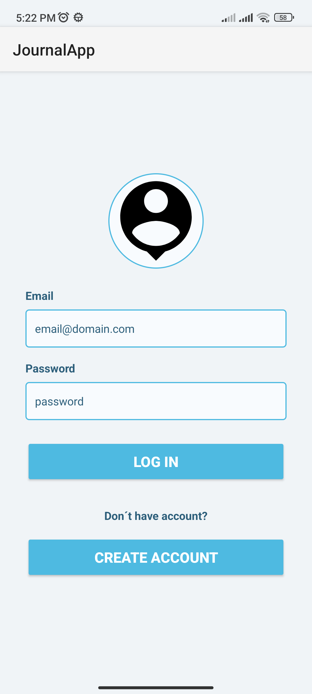
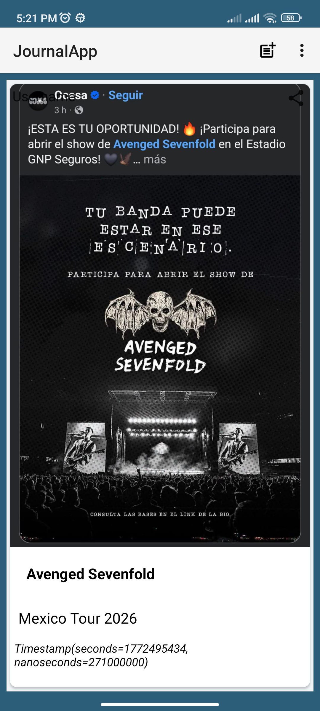
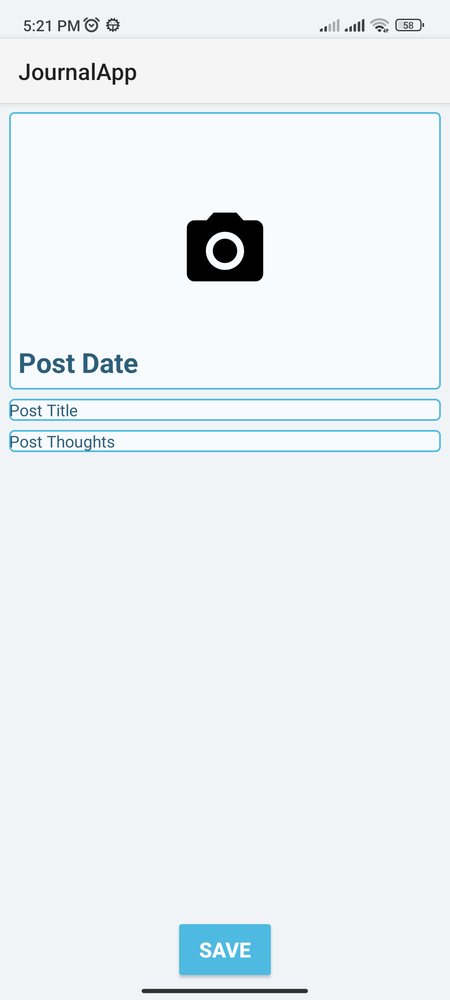

# Journal-App
Es una aplicación de diario personal desarrollada en Kotlin que permite a los usuarios documentar sus pensamientos y momentos importantes de forma segura en la nube. La aplicación utiliza una arquitectura robusta y moderna para gestionar contenido multimedia y sincronización en tiempo real. 

## 🎯 Objetivo del proyecto
- Guardar y crear diarios.
- Gestión de Publicaciones: Creación, lectura y visualización de "Journals" con títulos, descripciones e imágenes.
- Arquitectura MVC.
- Lenguaje Kotlin.
- Sea fácil de mantener y extender.

## 🚀 Características
- Interfaz de usuario limpia e intuitiva.
- Autenticación de Usuarios: Registro e inicio de sesión seguro mediante Firebase Auth.
- Interfaz Dinámica: Uso de DataBinding y BindingAdapters para una vinculación de datos eficiente y una UI fluida.
- Vistas Optimizadas: Implementación de RecyclerView con adaptadores personalizados para la visualización de listas.
- Lottie para Android: Implementación de animaciones basadas en vectores exportadas desde After Effects.
- Material Design 3: Para los componentes de UI como `TextInputLayout` y el manejo de estados de contraseña.

## 🛠️ Tecnología utilizada
- Android SDK.
- Kotlin.
- Database Cloud Firestore.
- Firebase Storage.
- LottieFiles. 
- Glide (Manejo eficiente de caché y renderizado).
- Arquitectura: Model-View-ViewModel (MVVM) conceptual.
- UI Components: Material Design, DataBinding, CardViews.

## 📌 Mejoras futuras
- Implementacion de elimnacion y modificación de diarios.
- Opcion de borrar la cuenta.

## 📱 Screenshots

  
  
  

## 🎥 Demo

## 👤 Autor
Adrián Hernández López / 
Desarrollador Android
